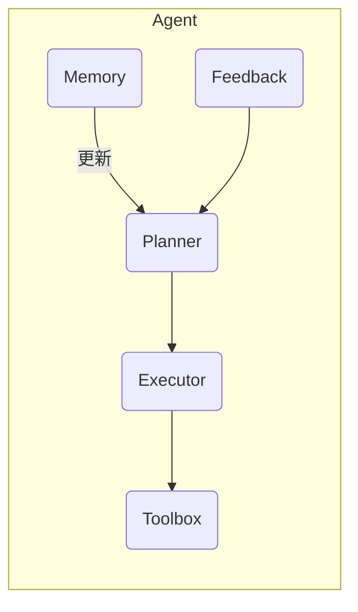

# Core Skills Mastery (45 min) – Notebook Outline

> 本文件为 Jupyter Notebook (`core_skills_training.ipynb`) 的 **文本雏形**，后续将按单元格拆分为 Markdown 与 Code。

## 目录
1. 前言
2. Prompt 工程 (18 min)
   2.1 Prompt 基础概念
   2.2 模板设计原则 (TACOS)
   2.3 三段式迭代示例
   2.4 练习：优化错误的 Prompt
3. Tools 工具集成 (12 min)
   3.1 Tool 调用流程
   3.2 示例：调用公开 REST API
   3.3 错误处理与重试策略
   3.4 练习：封装你自己的工具
4. 模型微调 (8 min)
   4.1 SFT vs RFT 概述
   4.2 最小化 SFT 示范代码
   4.3 评估与部署注意事项
5. MCP 服务 (5 min)
   5.1 MCP 定义与价值
   5.2 示例：扩展 Agent 边界
6. AI Agent 基础架构 (2 min)
   6.1 五大核心组件
   6.2 Mermaid 架构图
7. 总结与 FAQ

---

## 1. 前言 _(Markdown Cell)_
- 培训目标、受众、预期收获
- 课程结构图

## 2. Prompt 工程 _(Markdown + Code)_
### 2.1 Prompt 基础概念
- 定义：Prompt = 指令 + 上下文 + 输出格式
- 核心要素：角色、任务、约束、示例

### 2.2 模板设计原则 (TACOS)
> **T**ask, **A**udience, **C**ontext, **O**utput, **S**tyle

### 2.3 三段式迭代示例
```python
# Code Cell: 演示 Prompt 迭代
```

### 2.4 练习
- **任务**：改写下方低质量 Prompt 以提升准确率

---

## 3. Tools 工具集成 _(Markdown + Code)_
### 3.1 Tool 调用流程
1. 用户意图解析 → 2. 参数准备 → 3. 工具调用 → 4. 结果解析

### 3.2 示例：调用公开 REST API
```python
# Code Cell: 调用天气 API 示例
```

### 3.3 错误处理与重试策略
- 超时、异常格式、速率限制

### 3.4 练习
- **任务**：封装一个翻译 API 工具并调用

---

## 4. 模型微调 _(Markdown + Code)_
### 4.1 SFT vs RFT 概述
| | SFT | RFT |
| - | - | - |
| 目的 | … | … |

### 4.2 最小化 SFT 示范代码
```python
# Code Cell: 示范使用 OpenAI Fine-tuning
```

### 4.3 评估与部署注意事项
- 过拟合、数据漂移、监控

---

## 5. MCP 服务 _(Markdown)_
### 5.1 MCP 定义与价值
- 扩展 Agent 能力边界

### 5.2 示例
```python
# Code Cell: MCP 调用示例 (占位)
```

---

## 6. AI Agent 基础架构 _(Markdown)_
- 五大核心组件：Planner、Memory、Toolbox、Executor、Feedback


---

## 7. 总结与 FAQ _(Markdown)_
- 关键 takeaways
- 常见问题解答

---

> **TODO**: 将本文件拆分为 Notebook 单元格，并补充代码实现与示例数据。 