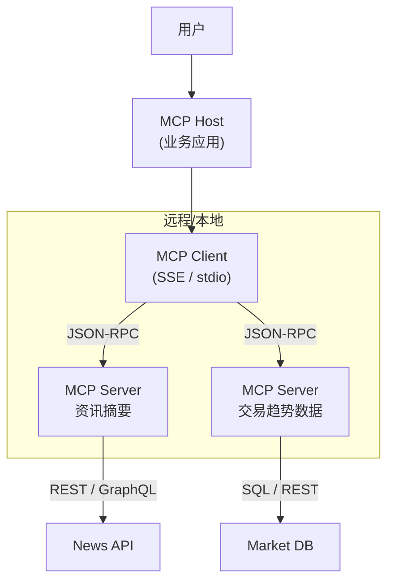

# MCP 基础教程

> 面向银行业资讯摘要与交易趋势场景的实践指引 （版本 2025-07-03）

---

## 1. 什么是 MCP？

Model Context Protocol（MCP）是由 Anthropic 首创、现已被 OpenAI、Microsoft 等主流厂商共同采纳的 **开放标准**，用于在"大模型 ↔ 外部系统"之间建立统一的 **上下文与工具调用通道**。它被称为 "AI 领域的 **USB-C**"，让任何合规的大模型都能即插即用地访问：

* **Resources** 结构化/非结构化数据（如新闻全文、行情快照、PDF 等）
* **Tools** 具备副作用的动作（如行情查询、风控打标、下发提示）
* **Prompts** 经过优化的提示模板（让模型"走安全/高效套路"）

在银行业场景中，MCP 能让 **资讯摘要 Agent** 与 **交易趋势分析 Agent** 安全地读取内部数据湖、行情终端和合规工具，而无需编写 N×M 式的专用 SDK。

---

## 2. 核心角色与通信流程



* **Host**：银行内部桌面/网页应用（例如"晨会助手"）。
* **Client**：由 Host 启动并维护，与每个 Server 一一配对。
* **Server**：包装新闻接口、行情数据库或风控微服务，负责"翻译"成统一 JSON-RPC。

---

## 3. 为什么银行需要 MCP？

| 传统做法 | MCP 方案 |
| --- | --- |
| 每接入 1 个新数据源就要写 1 套专用连接器；合规审核 & 安全渗透反复进行。 | 银行侧只需一次性实现 **MCP Client**，任何新系统只要暴露 MCP Server 即刻可用。 |
| 工具描述、权限范围、输入输出格式各不相同，模型难以信任。 | 通用 JSON Schema + 自动工具发现，方便做 **细粒度白名单** 与 **参数校验**。 |
| 难以做到"人机共管"——模型调用高风险 API 时缺少兜底。 | MCP 支持 "require_user_approval" 等机制，可强制人工二次确认。 |

---

## 4. 快速上手

### 4.1 部署一个本地文件系统 Server（资讯摘要示例）

```bash
# 需要 Node.js ≥18
npx -y @modelcontextprotocol/server-filesystem ~/bank_news_repo
```

该 Server 自动注册 3 个工具：

1. `list_files` 列出可读文件
2. `read_file` 读取全文
3. `search_files` 按关键词检索

### 4.2 在 Python 中连接 Anthropic Claude + MCP

```python
from anthropic import Anthropic
from mcp.client.sse import sse_client

client = Anthropic(api_key="$CLAUDE_KEY", beta_headers={"anthropic-beta": "mcp-client-2025-04-04"})

# 启动本地 server
fs_client = sse_client(url="http://localhost:8080/sse", name="local-news")

with fs_client as mcp:
    tools = mcp.list_tools()
    print("发现工具:", [t.name for t in tools.tools])

    # 让 Claude 读取新闻并生成摘要
    messages = [
        {"role": "user", "content": "请阅读最新利率政策新闻并做 200 字摘要"}
    ]

    resp = client.messages.create(
        model="claude-3-opus-20250409",
        max_tokens=512,
        messages=messages,
        mcp_servers=[mcp.server_config()],
    )
    print(resp.content)
```

---

## 5. 典型银行业务示例

### 5.1 智能晨报（资讯摘要）

1. Server A 连接内部新闻知识库；Server B 连接公募基金公告接口。
2. Host 调度模型自动调用 `search_news` → `read_file` → 汇总写入 Markdown，附加"仅供参考，不构成投资建议"声明。
3. 合规人员通过审阅 UI **一键审批** 发布到私域企微群。

### 5.2 趋势预警（交易趋势）

1. Server C 暴露 `get_market_snapshot`、`calc_technical_indicators` 等行情工具。
2. MCP Client 将每日 K 线、成交量作为 Resources 供模型读取。
3. LLM 触发 `calc_technical_indicators` 并根据阈值调用 `send_risk_alert`（需要审批）。
4. 结果同步写入风控审计链路，符合《银行业监督管理办法》留痕要求。

---

## 6. 安全与合规要点

1. **最小权限原则**：使用 `tool_configuration.allowed_tools` 只暴露业务必需工具。
2. **OAuth / VPN 隔离**：远程 MCP Server 建议布署在 DMZ，并启用双因素认证令牌。
3. **完善审计**：所有 `mcp_tool_call` / `mcp_tool_result` 需落库，包含调用人、输入、输出、审批人、时间戳。
4. **免责声明**：资讯类输出统一追加"仅供参考，风险自担"；趋势模型不得直接下单。

---

## 7. 常见问题 FAQ

**Q1：MCP 与 OpenAI Function Calling 有何区别？**  
Function Calling 解决"模型内部 ↔ 函数"问题，MCP 解决"**端到端** 数据/工具生态整合"问题，可在底层调用 Function Calling 实现。

**Q2：MCP 是否支持流式数据？**  
是。除了 HTTP-SSE 之外，最新草案还支持 **Streamable HTTP**，可用于实时行情推送。

**Q3：如何在行内灰度发布？**  
建议先在低网段内网部署 MCP Server，使用沙箱账号跑通全流程，再逐步对接正式生产数据源。

---

## 8. 结语

MCP 为银行大模型落地提供了 **"统一连接层 + 安全治理抓手"**。借助本文示例，您可以在数小时内把资讯摘要与交易趋势分析两大核心场景跑通，并通过最小化改动接入更多系统。

> 下一步：试着将本行自研的智能投研平台包装成 MCP Server，赋能更多 AI Agent！

---

© 2025 Bank AI Agent Training Project. This document is licensed under CC-BY-NC-SA 4.0. 