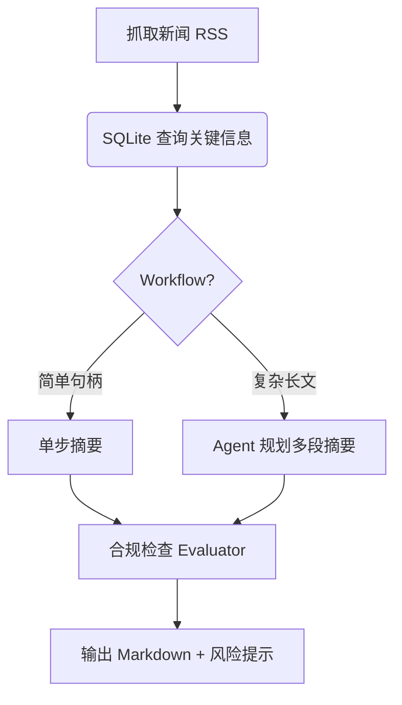

# AI Agent 架构与最佳实践 —— 教学笔记

> 资料来源  
> 1. Anthropic | Building Effective Agents  
> 2. Anthropic | Built a Multi-Agent Research System  
> 3. OpenAI | A Practical Guide to Building Agents (PDF)  
> 4. OpenAI Platform Docs | Agents Guide

---

## 0. 课程定位
- **目标读者**：银行 IT / 风控 / 业务 / 产品等内部人员  
- **应用聚焦**：  
  1. 资讯摘要（News Summarization）  
  2. 交易趋势分析（Trading Trends）  
- **合规提示**：输出仅供参考，不构成投资建议；资金操作仍须后端风险审批。

---

## 1. Agent 基础概念
| 概念 | Anthropic 表述 | OpenAI 表述 | 教学要点 |
|------|----------------|-------------|----------|
| Augmented LLM | 本地 SQLite 存储 + 工具（可选 RAG） | Retrieval + Tools + Memory | 先用轻量 SQLite 记忆库，再考虑向量检索 |
| Workflow | 预定义流程，LLM 按脚本执行 | Toolformer / 函数调用链 | 适合确定性子任务（如批量摘要） |
| Agent | 动态规划、自主调用工具 | 循环感知-思考-行动 (Perception-Think-Act) | 适合开放式、步骤难预判的任务 |
| ACI | Agent-Computer Interface | Function Calling / JSON Schema | 工具描述要"傻瓜化"+ 例子齐全 |

---

## 2. 设计三大核心原则
1. **Simplicity 简洁优先**  
   - 先做"单调用 + 检索"能满足就别上多轮 Agent  
2. **Transparency 透明可诊断**  
   - 显式输出 plan / thought / tool 使用记录  
3. **Robust ACI 工具接口稳健**  
   - Poka-Yoke：参数命名直观、示例覆盖边界、添加格式校验

---

## 3. 常见 Agentic 模式（可映射到银行场景）
| 模式 | 机制 | 典型金融应用 |
|------|------|--------------|
| Prompt Chaining | 串行多步 | "晨报生成 ➜ 合规检查 ➜ 推送" |
| Routing | 分类后走不同子链 | 客户问题分类：行情/政策/风险 |
| Parallelization | Section & Voting | 多指标并行评估股票趋势 |
| Orchestrator-Workers | 动态拆解 | 多渠道资讯抓取 + 摘要聚合 |
| Evaluator-Optimizer | 生成-评审循环 | 投研报告润色 & 风险措辞校对 |

---

## 4. 实战 Blueprint：资讯摘要 Agent

> 备注：如需多渠道（英文+中文）并行，可在 B-E 之间插入 `Parallel Sectioning`。

---

## 5. 实战 Blueprint：交易趋势分析 Agent
1. 拉取日线 / 分钟级行情 → 指标计算 (MA, RSI, OBV…)  
2. Router 判断"波段 vs. 震荡" → 选择不同分析模板  
3. Orchestrator 调度：  
   - 子 Agent-1：基本面检索 (RAG 金融报告)  
   - 子 Agent-2：技术指标解释  
   - 子 Agent-3：风险事件扫描  
4. Aggregator 汇总 → Evaluator 检查一致性 → 输出投资提示（含免责声明）

---

## 6. 教学 Notebook 结构（已实现）
| Cell | 类型 | 内容 | 时长 |
|------|------|------|------|
| 1 | Markdown | 课程引言 & 学习目标 & 合规声明 | 2分钟 |
| 2 | Python | 环境依赖安装和 Claude API 配置 | 3分钟 |
| 3 | Markdown | AI Agent 核心概念解析 | 5分钟 |
| 4 | Python | SQLite 记忆存储系统初始化 | 3分钟 |
| 5 | Python | Claude API 流式调用函数 | 2分钟 |
| 6 | Markdown | Workflow 模式：资讯摘要 Agent | 2分钟 |
| 7-9 | Python | 3步骤 Prompt Chaining（提取→摘要→合规） | 10分钟 |
| 10 | Markdown | Agent 模式：交易趋势分析智能体 | 2分钟 |
| 11 | Python | Agent 工具集定义和测试 | 5分钟 |
| 12 | Python | TradingAnalysisAgent 类实现 | 5分钟 |
| 13 | Python | 执行 Trading Agent 完整分析 | 5分钟 |
| 14 | Markdown | 多智能体协作模式介绍 | 2分钟 |
| 15 | Python | MultiAgentOrchestrator 银行板块分析 | 6分钟 |
| 16 | Markdown | 课程总结与技术展望 | 3分钟 |
| 17 | Python | 数据清理和学习记录总结 | 2分钟 |

---

## 7. 风险与合规清单
- 不可自动执行交易；仅做"分析/建议"  
- 记录所有参数 & 日志，满足审计  
- 对外输出统一加注：  
  > "本分析基于公开数据，结果仅供参考，不构成投资建议，投资需谨慎。"

---

## 8. 延伸阅读
- Anthropic: Building effective agents (2024-12)  
- Anthropic: Multi-Agent Research System (2024-03)  
- OpenAI: A Practical Guide to Building Agents (2024-04)  
- OpenAI Docs: Function Calling & Agent Patterns  